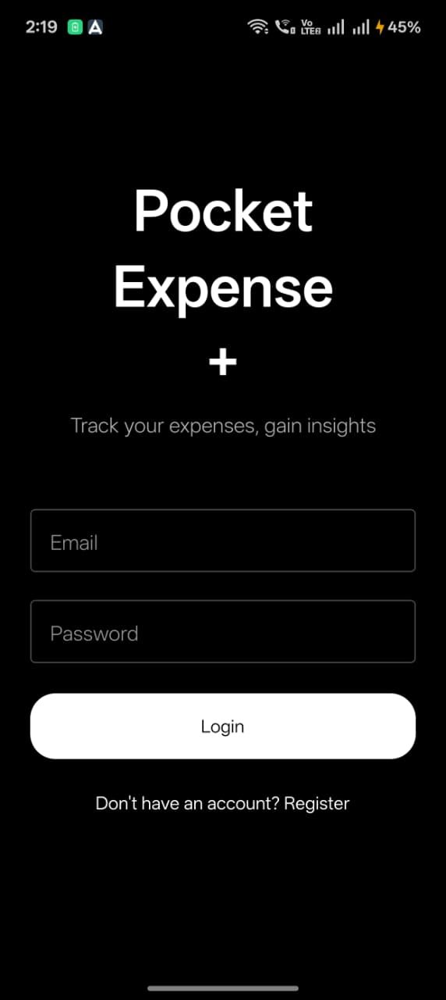
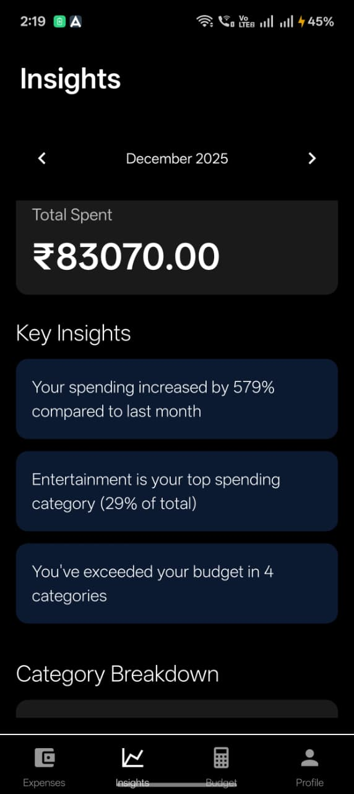
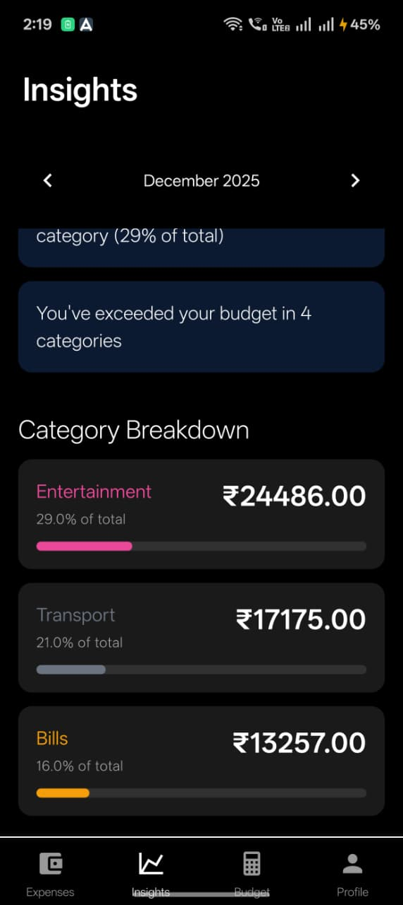
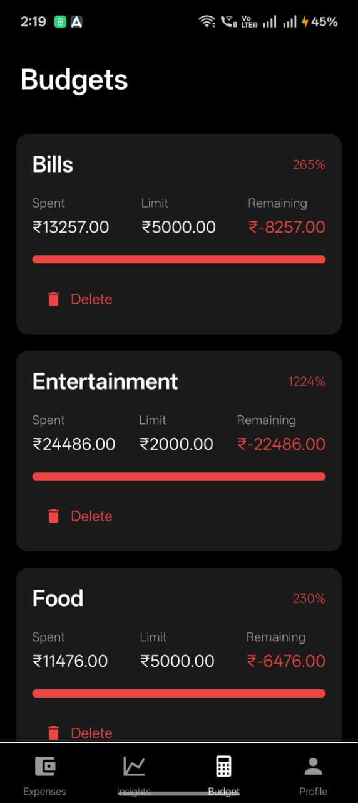
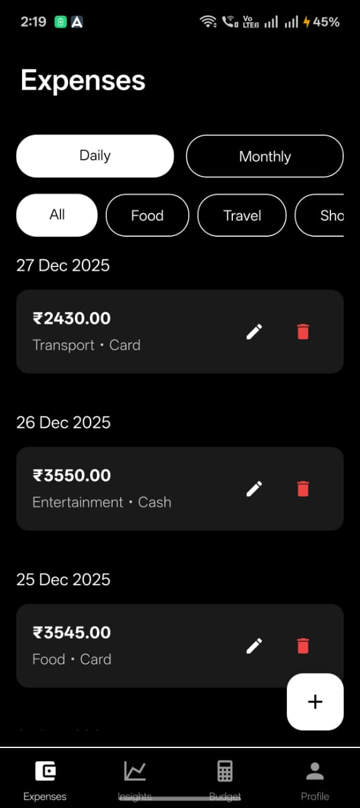
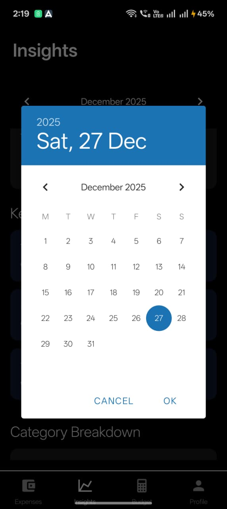
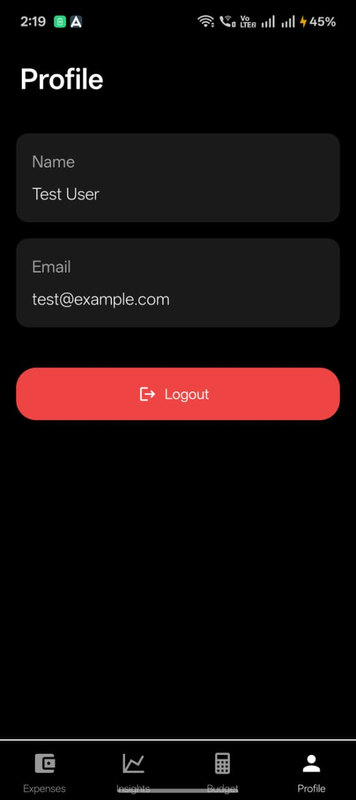

# PocketExpense+ - Expense Tracking with Insights

Full-stack expense tracking app with offline support, insights, and budget management.

## Features

- User authentication (JWT)
- Add, edit, delete expenses
- View expenses (daily, monthly, all)
- Category-wise breakdown
- Spending insights with month-over-month comparison
- Offline support with automatic sync
- Monthly budget limits
- Overspending notifications

## Tech Stack

**Frontend:**
- React Native (Expo)
- TypeScript
- React Native Paper
- React Navigation
- Context API
- AsyncStorage

**Backend:**
- Node.js + Express
- TypeScript
- MongoDB
- JWT Authentication

## Setup

### Prerequisites
- Node.js (v20 or v22 recommended)
- MongoDB (local or cloud)
- Expo CLI (optional, comes with npm start)

### Backend

1. Navigate to backend folder:
```bash
cd backend
```

2. Install dependencies:
```bash
npm install
```

3. Create `.env` file (copy from `.env.example`):
```
PORT=5000
MONGODB_URI=mongodb://localhost:27017/pocketexpense
JWT_SECRET=your_jwt_secret_key_here_change_this
NODE_ENV=development
```

4. Start MongoDB (if running locally):
```bash
# Windows (if installed as service, it should auto-start)
# Or use MongoDB Atlas for cloud database
```

5. Run backend:
```bash
npm run dev
```

Backend will run on `http://localhost:5000`

6. (Optional) Seed database with sample data:
```bash
npm run seed
```

This creates a test user with sample expenses and budgets:
- Email: `test@example.com`
- Password: `password123`

### Frontend

1. Navigate to frontend folder:
```bash
cd frontend
```

2. Install dependencies:
```bash
npm install
```

3. Update API URL in `src/services/api.ts`:
   - For Android emulator: `http://10.0.2.2:5000/api`
   - For iOS simulator: `http://localhost:5000/api`
   - For physical device: `http://YOUR_COMPUTER_IP:5000/api`

4. Install Expo Go app on your phone:
   - Android: [Google Play Store](https://play.google.com/store/apps/details?id=host.exp.exponent)
   - iOS: [App Store](https://apps.apple.com/app/expo-go/id982107779)

5. Run app:
```bash
npm start
```

6. Scan the QR code:
   - Open Expo Go app on your phone
   - Tap "Scan QR code"
   - Point your camera at the QR code shown in the terminal
   - Make sure your phone and computer are on the same Wi-Fi network

## API Endpoints

### Auth
- `POST /api/auth/register` - Register user
- `POST /api/auth/login` - Login user

### Expenses
- `GET /api/expenses` - Get all expenses (query: startDate, endDate, category)
- `POST /api/expenses` - Create expense
- `GET /api/expenses/:id` - Get expense by ID
- `PUT /api/expenses/:id` - Update expense
- `DELETE /api/expenses/:id` - Delete expense
- `GET /api/expenses/stats` - Get stats (query: month, year)

### Budget
- `GET /api/budgets` - Get budgets (query: month, year)
- `POST /api/budgets` - Create/update budget
- `DELETE /api/budgets/:id` - Delete budget

### Analytics
- `GET /api/analytics/monthly` - Get monthly stats (query: month, year)
- `GET /api/analytics/insights` - Get spending insights

### Screenshots

<div align="center">
  
  
  
  <br/>
  
  
  
  <br/>
  
</div>


## Project Structure

```
├── backend/
│   ├── src/
│   │   ├── models/       # MongoDB models
│   │   ├── routes/       # API routes (auth, expenses, budgets, analytics)
│   │   ├── middleware/   # Auth middleware
│   │   ├── scripts/      # Database seeding scripts
│   │   └── index.ts      # Server entry
│   └── package.json
├── frontend/
│   ├── src/
│   │   ├── screens/      # App screens
│   │   ├── services/     # API services
│   │   ├── context/      # State management
│   │   ├── navigation/   # Navigation setup
│   │   └── types/        # TypeScript types
│   └── package.json
└── README.md
```

